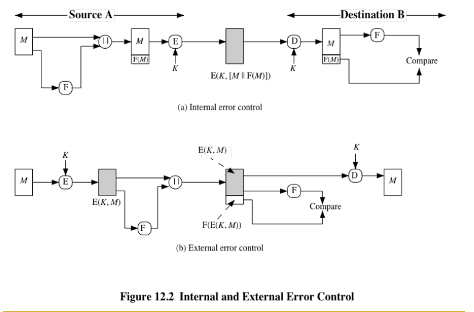

# Week 6

## Hash function

A hash function makes a variable- length block of data M as input and get fixed-size output

Mapping a big space to smaller space...

To protect massage change

One-way property

collision-free -> cannot (infeasible) find two data with the same value, output looks completely random

cannot detect active attack -> function is public

### Message Authentication Code (MAC)

Keyed hash function

For textbook RSA, signing and decrypt is the same...

### Other Hash Function 

One-way password file -> store the hash of password

intrusion and virus detection -> every virus from network has special signature, hash it and compare it with other data.

Pseudorandom number generator (PRNG)

### Two Insecure hash function

Sample XOR

One-bit circular shift

### Hash function requirement

1. Variable input size; input -> can be any size
2. output -> must be fixed size for all input -> larger size the more collision resistant
3. Efficiency: easy to compute H(x) from x
4.  one way function -> Infeasible to compute x from H(X) 
5. collision resistant(weak) -> computation infeasible
6. collision resistant(Strong) -> cannot find a pair of (x,y) that H(x) = H(y)
7. Pseudorandonness -> output is random

### Attacks on Hash Function

* Brute-force attack

* preimage, second preimage attack

* against collision resistance

* Birthday attack -> find two different messages hashing the same value

  ​

---

### why use hash function before signature

* get fixed size output computation

* integrity check of message -> make sure massage has not been changed

* against replace attack

  ​

---

## MAC

### MA

Protecting the integrity of a message

validating identity of originator 

non-repudiation of origin -> the origin should not be able to deny it.

**Two level**

Lower level: the function that produces an authenticator

Higher-level: a higher level protocol that enables a receiver to verify the authenticity of a message

**Three function**

Hash function -> cannot only use hash function

Message encryption

Message authentication code (MAC)

### Message Authentication Code (MAC)

* Generated by an algorithm that creates a small fixed-sized block
* Appended to message as a signature
* Receiver performs same computation on message and checks it matches the MAC
* Provides assurance that message is unaltered and comes from sender

First one is more secure

### MAC Properties

* a MAC is a cryptographic checksum

  ​	MAC = CK(M)

  * condenses a variable-length message M
  * **using a secret key K**
  * to a fixed-sized authenticator

* is a many-to-one function

  * potentially many messages have same MAC
  * but finding these needs to be very difficult

``Workshop for week 7``

---

END