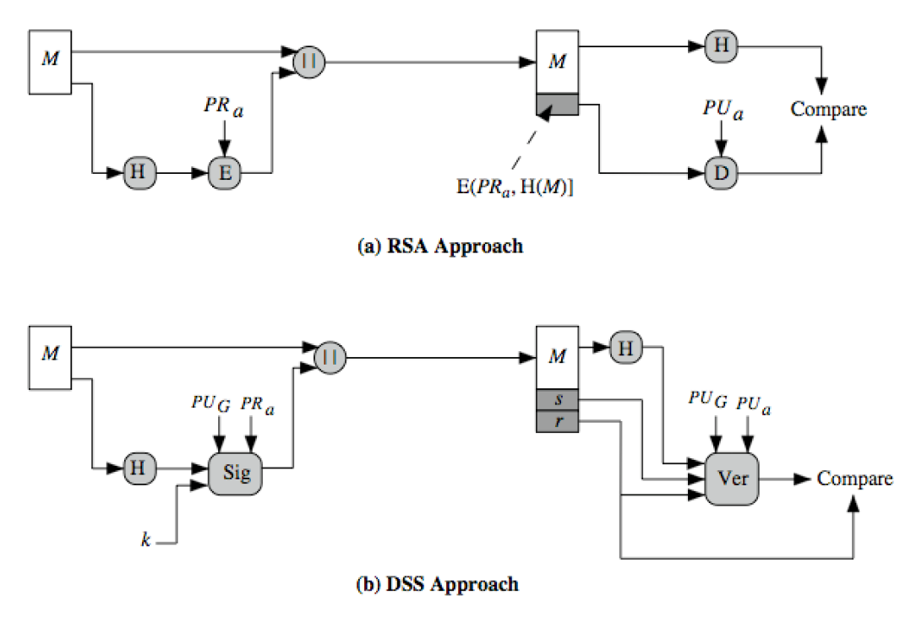

# Week 9

 

## ElGamal Signature

The signature should have non-repudiation property (the signer cannot deny creating the signature).

S1,S2

Verify

### Schnorr Signature

???

###Digital Signature Standard (DSS)

 

### Digital Signature Algorithm (DSA)

Smaller and faster than RSA

depends on difficulty of computing discrete logarithms

ElGamal& Schnorrschemes

Maximum size of the cyclic group = p-1.

 

---

END

